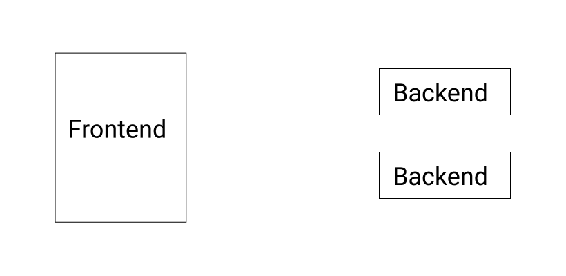
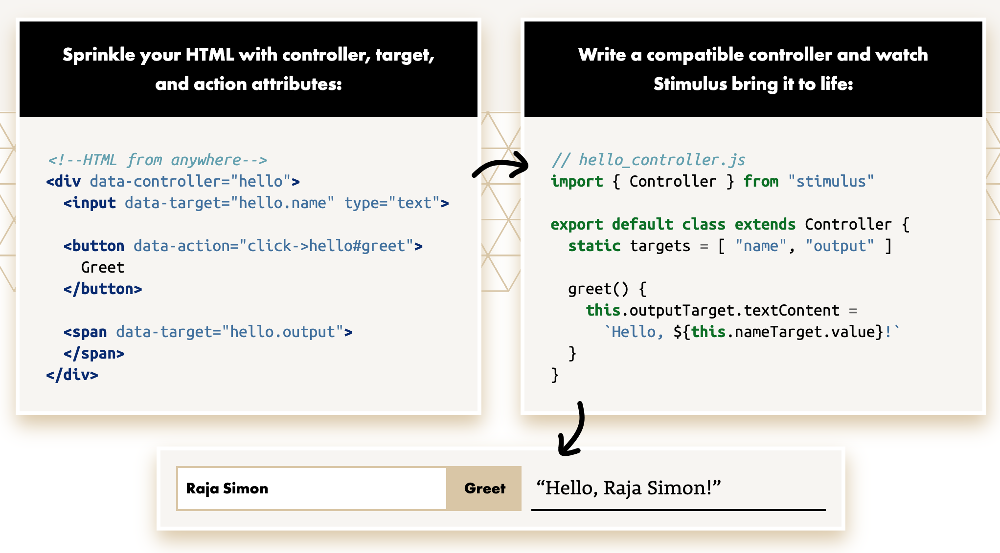

We all know about single-page applications, but what is this multi-page application and how that is different from monolith architecture. And does we call serverless architecture a multi-page application?. In this post, we are going to see what it is and what are the benefit of using it. So without further due, let’s, deep dive.

## What we know about SPA


Traditional single page applications will have unique frontend applications usually run in Netlify or another static site hosting. And one backend normally Django or Ruby on Rails for serving the frontend requests. It may also have multiple backend applications, but that all serves the API request to frontend application on demand. 

This comes with an internal lock system whenever you wanted to change something on the frontend. You need to replace code in both places, one from frontend and corresponding backend code. To avoid this behavior, we could rely on multi-page application architecture.

## Intro to multi-page application

A multi-page application is part of the server-side rendering. When someone clicks on the button you just push the relevant HTML code to frontend. And the frontend replaces the part of the page. It looks exactly reactive frameworks because server-side rendering allows you to change the view of the page without refreshing the whole page.

In other words, you may have multiple backend server running different differnt languages but all serves the generated server side html code to frontend and the frontend will act like gathering html from the backend and displaying it.



So now you know how to create a multi-page application in theory but to achieve that we should rely on one javascript framework which is called [stimulus js](http://stimulusjs.org/). This Stimulus is very easy to use and we can use that with normal Django application. Let’s looks into this simple Stimulus example and how we can use this to achieve our multi-page application.




What is really going on here? We have HTML code and Javascript code. In the Javascript code, we have to define controller targets and function to execute the code. Based on the above example when someone clicks the “Greet” button entered text taken from the input and added into an output span.

This looks great and works really like reactive framework. Well, it’s not two-way data binding and there is an action involved to trigger the controller to execute the function. To make this one step further let’s change the greet function to make the network call. 

```
loadPage(target) {
    fetch(remoteEndpoints[target])
     .then(resp => resp.text())
     .then(html => {
       this.showTargets[0].innerHTML = html
     })
}
```

I've created the `loadPage` function with fetch network call. This will call the remoteEndpoints with particular targets. My target all looks like this. 

```
const remoteEndpoints= {
    loremipsum: 'http://localhost:8000/loremipsum/',
    about: 'http://localhost:8080',
    dashboard: 'http://localhost:3000',
    accounts: 'http://localhost:4000/accounts',
    pricing: 'http://localhost:1313/pricing'
}
```

You can create N number of endpoints defined or store it in the cloud and make it available on the runtime using the `initialize` call. When the page loads this controller will call the `initialise` function and that time you can load the default content.

## Backend Setup

Make the Stimulus serves from the Django template using the help of `stimulus.application.register`. Once you registered, you can use the Stimulus without node build. Let's make the navigation and the initial `base.html` serves from the Django template. And when someone clicks the navigation trigger the controller to execute the `loadPage` function.

I've mentioned server side rendering in the beginning of the blog posts but this is not really a server side rendering. Instead, you just return the actual HTML content in the response  to display in the browser. 

## Use case for multi-page architecture
I've put together some of the use cases for using multi-page applications. Looks complex to implement but really it's really cool for large scale application.

1. A reactive framework like interface.
2. Have multiple framework outputs in a single application.
3. Multiple teams can develop applications separately. 

## Conclusion
We saw how MPA is different from SPA and you can check out all the code in this GitHub repo [django-multi-page-application](https://github.com/rajasimon/django-multi-page-application). 

Feel free to reach out to me on [twitter](https://twitter.com/rajasimon) if you need any help 